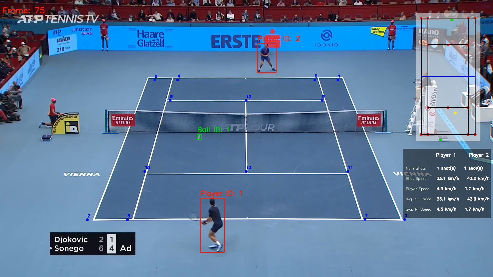

# Tennis Analyzer
This project utilizes various computer vision techniques to track two tennis players, a court's key-points, and a tennis ball. It also measures the players' ball shot speed, movement speed and number of shots that they have taken.

# Models Used
1. Out of the box YOLOV8 to do Object Tracking on the Players
2. Fine-tuned YOLOV5 to do Object Detection on the Tennis Balls
3. Fine-tuned RESNET50 to do keypoint detection on the court.   
[Link to trained models](https://drive.google.com/drive/folders/17Nq1G18tbb7NOmqLeafRaAvmgad801Rx?usp=drive_link)

# Example of Output

# Training
- YOLOV5 model training for Ball Detection: training/tennis_ball_detector_training.ipynb
- RESNET50 model finetuning for court keypoint detection: training/tennis_court_keypoints_traning.ipynb

# Requirements
- python3.11
- pytorch
- ultralytics
- pandas
- numpy
- opencv

# Contributions
Many thanks to Abdullah Tarek for his video guidance on this project.
